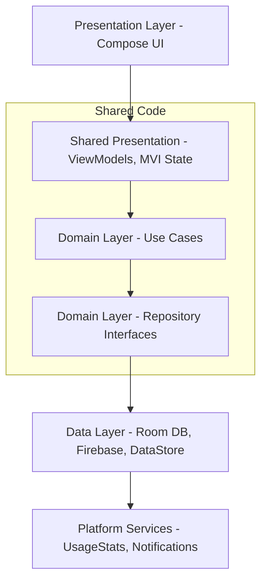

# AwareMate

[](https://github.com/husoelrey/AwareMate/actions/workflows/ci.yml)
[](https://opensource.org/licenses/Apache-2.0)
[](https://kotlinlang.org)
[](https://www.jetbrains.com/lp/compose-multiplatform/)
[](https://developer.android.com)

> **Compassionate Awareness Companion App for Youth Growth & Healthy Digital Habits**

[Contributing Guide](CONTRIBUTING.md) • [Privacy Policy](docs/PRIVACY_POLICY.md) • [Store Asset Specifications](docs/STORE_ASSET_SPEC.md)

---

## 1. Executive Summary & Vision
**AwareMate** is a compassionate awareness companion app built with Kotlin Multiplatform and Compose Multiplatform. 
Our core mission is to transform reclaimed screen time into meaningful personal growth through compassionate awareness. Rather than using punitive streaks or absolute blocks, AwareMate utilizes empathetic design and a companion character system to foster long-term habit formation.

**Erasmus+ Alignment:**
AwareMate is designed to align with the 4 horizontal priorities of the Erasmus+ youth project, empowering youth through digital literacy, environmental awareness, civic participation, and inclusion.

**Market Gap:**
No current application seamlessly combines digital, personal, environmental, and civic awareness into a single, cohesive, free, and open-source platform.

## 2. System Architecture & Module Topology
The application follows Clean Architecture principles paired with an MVI presentation pattern.



## 3. Companion System Design
AwareMate centers around a plant-based companion system that reflects the user's progress.

- **Growth Stages:** `SEED` → `SPROUT` → `BLOOM` → `TREE` → `ANCIENT_TREE`
- **XP System:** Users earn XP in distinct categories: Happiness, Energy, Wisdom, and Creativity.
- **Compassionate Design:** There is no "death" state. We eschew punishment and guilt. The companion responds empathetically to lapses.
- **Momentum Score:** Instead of binary streaks (where one missed day equals complete failure), AwareMate uses a momentum score that decays gradually.

## 4. Awareness Modules

### Digital Awareness
- **UsageStats Integration:** Safely aggregates application usage time (Android-first).
- **Mindful Nudges:** Gentle, configurable notifications when screen time thresholds are breached.
- **Focus Sessions:** Timer functionality paired with companion animations.
- **Digital Sunset:** Evening reminders to disconnect and wind down.

### Personal Growth
- **Mood Journal:** Log feelings with emojis and notes.
- **Breath Exercises:** Guided, animated breathing exercises.
- **Hobby Discovery:** Suggestions for offline activities based on user preferences.
- **Micro-challenges:** Small, achievable daily tasks to earn XP.
- **Reflection Prompts:** End-of-day introspection questions.
- **Self-Discovery Prompts:** Lightweight cards that surface habitual behaviors a user may never have noticed about themselves (e.g. a one-sided physical habit). Framed as discovery, not comparison — no unsourced statistics or pass/fail framing.

### Future Modules
- Environmental Awareness
- Social/Civic Awareness

## 5. Technical Stack

| Technology | Purpose |
|------------|---------|
| Kotlin 2.2+ | Core language for business logic and UI |
| Compose Multiplatform | Declarative UI framework |
| Room KMP | Local SQLite database |
| Koin | Dependency Injection |
| Voyager | Multiplatform navigation |
| Firebase (Auth/Firestore) | Backend and synchronization |
| Coil 3 | Image loading |
| Vico | Charts and data visualization |

## 6. Data Model
Key domain entities:

```kotlin
data class User(
    val id: String,
    val momentumScore: Int,
    val preferences: Preferences
)

data class Companion(
    val id: String,
    val name: String,
    val stage: GrowthStage,
    val currentXp: Int
)

data class MoodEntry(
    val id: String,
    val timestamp: Instant,
    val emoji: String,
    val note: String?
)
```

## 7. MVI Architecture Pattern
We utilize the Model-View-Intent pattern to ensure unidirectional data flow.

- **Intent:** User actions or system events.
- **Reducer:** Pure function taking the current state and an intent, returning a new state.
- **State:** Immutable data class representing the UI state.

```kotlin
// Example
data class HomeState(val isLoading: Boolean, val companion: Companion?)
sealed class HomeIntent { object LoadData : HomeIntent() }
```

## 8. Data & Sustainability
- **No Data Selling:** Fully non-profit and open source; no ads, no monetization of user data.
- **Firebase Security Rules:** Users can only read/write their own documents.
- **Sustainability:** 100% free for users. Infrastructure costs (Firebase, hosting) are covered by optional donations/sponsorship — not ads or data monetization.
- **Store Requirements:** A minimal privacy policy page is still required for the Play Store listing and for Firebase Auth account creation, independent of internal priority — tracked in PLAN.md P7.

## 9. Accessibility
- Target: WCAG 2.1 AA.
- Full TalkBack/VoiceOver support with meaningful content descriptions.
- Dynamic text sizing and rigorous color contrast ratio enforcement.

## 10. Prerequisites & Setup

### Environment Requirements
- **JDK 17+** (Java 17 target compatibility, JDK 21 toolchain compatible)
- **Android SDK** API 35 (Android 15) with Build Tools 35.0.0+
- **Gradle 8.11.1+** (managed via the included `./gradlew` wrapper)
- **Android Studio** Ladybug / Meerkat or **IntelliJ IDEA** with Kotlin & Compose Multiplatform plugins

### Getting Started
1. **Clone the repository:**
   ```bash
   git clone https://github.com/husoelrey/AwareMate.git
   cd AwareMate
   ```

2. **Configure Firebase (`google-services.json`):**
   - *For Local Development / Offline Build:* A template is provided at `androidApp/google-services.json.example`. Copy it to `androidApp/google-services.json`:
     ```bash
     # Windows PowerShell
     Copy-Item androidApp/google-services.json.example androidApp/google-services.json
     # Unix / macOS
     cp androidApp/google-services.json.example androidApp/google-services.json
     ```
   - *For Real Firebase Integration:*
     1. Create a project in the [Firebase Console](https://console.firebase.google.com/).
     2. Register an Android app with package name `org.awaremate.android` (and `org.awaremate.android.debug`).
     3. Download the generated `google-services.json` and place it in the `androidApp/` directory (`google-services.json` is gitignored).
     4. Enable **Authentication** (Anonymous + Google Sign-In) and **Cloud Firestore**.

3. **Build and Test Commands:**
   - **Assemble Debug APK:** `./gradlew assembleDebug`
   - **Run Unit Tests:** `./gradlew test`
   - **Run Lint Checks:** `./gradlew lintDebug`

## 11. Project Structure
- `androidApp/`: Android specific configurations and entry point.
- `shared/`: The KMP module containing:
  - `commonMain`: Domain, Data, and Presentation logic shared across platforms.
  - `androidMain`: Android-specific implementations of shared interfaces.
  - `iosMain`: iOS-specific implementations (future).

## 12. Erasmus+ Alignment
- **Youth Goals:** Promotes mental health and well-being.
- **DigComp:** Fosters digital literacy and responsible technology usage.
- **GreenComp:** Environmental module (future) aligns with sustainability goals.

## 13. License
Licensed under the Apache License, Version 2.0.
