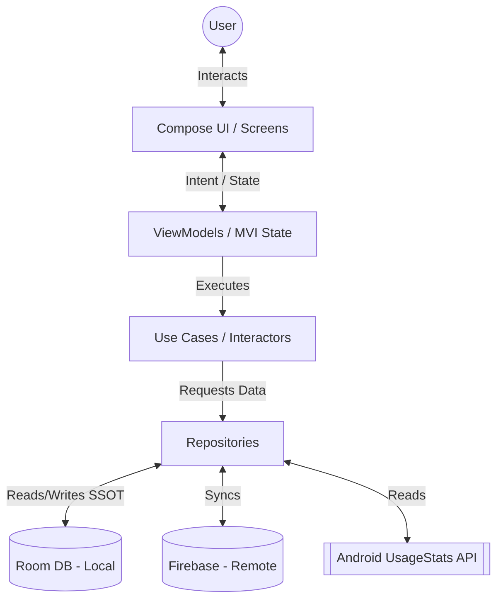
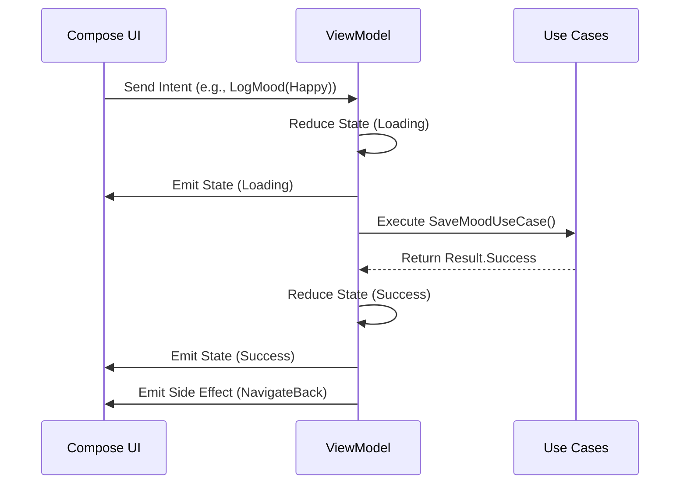

# AwareMate - Architecture Document

## 1. Architectural Goals
- **KMP Code Sharing:** Maximize business logic and UI code sharing across Android, iOS, Desktop, and Web using Kotlin Multiplatform and Compose Multiplatform.
- **Offline-First:** The app must be fully functional without an internet connection, treating the local database as the single source of truth.
- **Testability:** High test coverage enforced through clear separation of concerns (Clean Architecture).
- **Adaptive UI:** Fluid, responsive user interfaces powered by Material 3, adapting to different screen sizes.

## 2. System Context

## 3. Module Layout
The project follows a standard KMP directory structure:
- `shared/` - Contains all business logic, data management, and Compose Multiplatform UI.
  - `domain/` - Entities, Repository Interfaces, Use Cases, Error models.
  - `data/` - Room database, Firebase SDK implementations, API services, DataStore, Platform specific expect/actuals.
  - `presentation/` - ViewModels, MVI Intents/States, UI components, Navigation logic.
- `androidApp/` - Android application entry point, Manifest, Android-specific DI injection, WorkManager workers.
- `iosApp/` - iOS Swift entry point integrating the shared KMP framework.
- `desktopApp/` - JVM desktop entry point.
- `webApp/` - Kotlin/Wasm or Kotlin/JS entry point.
- `buildSrc/` or `gradle/libs.versions.toml` - Dependency management.

## 4. Clean Architecture Layers
- **Domain Layer:** Pure Kotlin. Contains domain models (e.g., `Companion`, `MoodEntry`), Repository interfaces, and Use Cases (`GetScreenTimeUseCase`, `AddXpUseCase`).
- **Data Layer:** Implements Domain interfaces. Manages Local data (Room), Remote data (Firebase Firestore), Preferences (DataStore), and Platform APIs (UsageStats, Expect/Actual hardware sensors).
- **Presentation Layer:** Houses Compose UI elements, ViewModels managing UI State, and MVI contracts.

## 5. MVI Data Flow
We utilize the Model-View-Intent (MVI) pattern for predictable state management.

## 6. Repository Pattern & Offline-First Strategy
- **Single Source of Truth (SSOT):** The Room database is always read from and written to directly by the UI/ViewModels.
- **Sync Strategy:** Firebase synchronizes with the Room database asynchronously via background workers or coroutine flows, never directly blocking UI updates.

## 7. Dependency Injection
- **Koin** is used across the KMP project.
- Modules are split by layer: `domainModule`, `dataModule`, `presentationModule`.
- Platform-specific modules handle implementations like Room database builders and Android Context injections.

## 8. Navigation
- **Voyager:** We use Voyager for multiplatform screen-based navigation.
- Provides type-safe arguments, seamless transition animations, and KMP-compatible ViewModel/ScreenModel scoping.

## 9. Companion Rendering System
- **Rendering:** The companion character will be rendered using Compose Canvas for procedural elements or KMP-compatible Lottie libraries (e.g., compottie) for vector animations.
- **State mapping:** The companion's visual state is a pure function of its Domain entity (Stage + Emotion).

## 10. Notification System
- **Local Nudges:** Android `WorkManager` handles scheduled digital well-being nudges and doom-scrolling alerts based on local UsageStats without requiring a server.
- **Remote Engagement:** Firebase Cloud Messaging (FCM) is used for broadcast announcements or specific remote nudges.

## 11. UsageStats Integration
- Because `UsageStats` is strictly an Android concept, we define an `expect interface ScreenTimeTracker` in `shared/` and provide the `actual class AndroidScreenTimeTracker` in the `androidMain` source set.
- iOS will use Screen Time API fallbacks if implemented in the future, abstracted behind the same interface.

## 12. Error Model
- All Use Cases return a wrapped `Result<T, DomainError>`.
- `DomainError` is a sealed interface encompassing `NetworkError`, `DatabaseError`, `PermissionDenied`, etc., mapped gracefully to UI feedback (Snackbars, empty states).

## 13. Testing Strategy
- **Domain Layer:** Pure JUnit/Kotlin test unit tests. Fast and robust.
- **Data Layer:** Room in-memory database tests (via SQLite on JVM or Android instrumented tests).
- **UI Layer:** Compose UI Test rules and screenshot testing for critical flows.

## 14. Architecture Quality Gates
- **Detekt / Ktlint:** Enforced formatting and static analysis on CI.
- **Coverage:** Kover used to ensure Domain layer > 80% coverage.
- **Dependency Rules:** Domain cannot depend on Data or Presentation. CI validates module graph structure.
